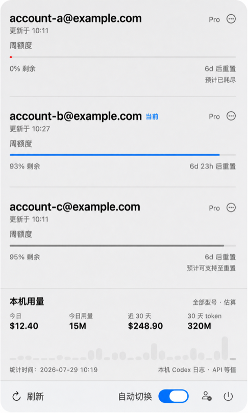

# CodexDog

[English](README.md) | [简体中文](README.zh-CN.md)

CodexDog 是一款原生 macOS 菜单栏看门狗。当当前 ChatGPT Codex 账号的额度即将耗尽时，它可以自动切换到其他账号。

应用安装后的名称为 `CodexDog.app`。



## 功能

- 管理任意数量的 ChatGPT Codex 账号。
- 展示 OpenAI 当前返回的官方额度周期。
- 当前账号剩余 1% 额度时自动切换。
- 切换账号后重启 ChatGPT，并尝试继续最近尚未完成的任务。
- 单独暂停某个账号的调度，或者删除账号。
- 直接扫描本地 Codex 会话日志，估算 Token 用量和 API 等值费用。

## 系统要求

- macOS 14 或更高版本。
- 已安装 `/Applications/ChatGPT.app`，并且可以使用 Codex。
- 至少拥有并自行管理两个 ChatGPT 账号。

## 安装

```bash
git clone https://github.com/forge-ui/codexdog.git
cd codexdog
./script/build_and_run.sh --install
```

应用会安装到 `~/Applications/CodexDog.app`。它只显示在 macOS 菜单栏，不会常驻程序坞；退出菜单栏应用也会同时停止看门狗。

也可以从 [Releases](https://github.com/forge-ui/codexdog/releases) 下载最新的 Preview 安装包。

## 使用

1. 从 macOS 菜单栏打开 CodexDog。
2. 点击底部的添加账号按钮，可以导入当前已登录的 Codex 账号，或者通过设备码登录其他账号。
3. 根据需要继续添加更多账号。
4. 打开“自动切换”。

CodexDog 通过 Codex app-server 读取官方额度数据。界面会根据 OpenAI 当前实际返回的额度周期展示内容，不会固定假设一定存在 5 小时或 7 天额度。

本地 Token 和费用数据直接根据本机 Codex 会话日志估算。内置扫描器基于 MIT 许可证下的 CodexBar v0.44.0，详情参见 [`THIRD_PARTY_NOTICES.md`](THIRD_PARTY_NOTICES.md)。

账号凭据仅保存在本机兼容旧版本的 `~/Library/Application Support/CodexRelay` 数据目录中，并使用仅限当前用户访问的文件权限。切换账号时会保留 `~/.codex` 的其他内容，只替换当前生效的 `auth.json` 凭据。

由于跨账号恢复任务并不是 OpenAI 提供的正式接口契约，因此任务续接属于尽力而为。

## 开发

```bash
swift test
./script/build_and_run.sh --verify
```
